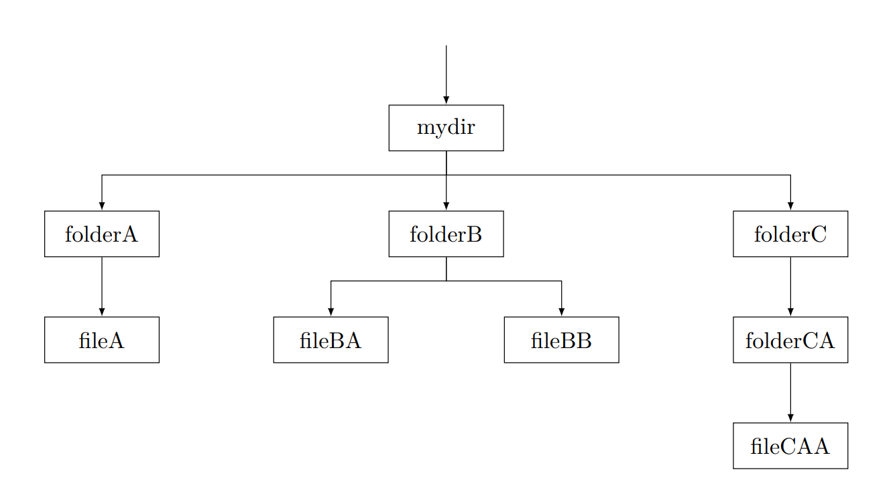

# Paths

Essentially there are only files and directories in linux.
Files are created by the `touch` command wheras directories are created by the `mkdir` command.
Directories can contain other directories or files wheras files are just files that can be written and read by programs.

## Trees

> When you see a dollar sign \$, you should type or copy the following command into your terminal.

First of all I would like you all to try this command: `$ tree /`

> If you terminal says this:
>
> ```bash
> Command 'tree' not found, but can be installed with:
>
> sudo apt install tree
> ```
>
> You just have to run
>
> ```bash
> $ sudo apt install tree
> ```

_Gratulations, you just hacked the NSA_

What you are seeing is a visual representation of all your files on your linux system.

### Let me explain with an example:

Set up an example folder structure

```bash
$ mkdir mydir/folder{A,B,C/folderCA} -p && touch mydir/folder{A/fileA,B/fileB{B,A},C/folderCA/fileCAA}
```

now run `$ tree mydir` and you should see the following:

```

mydir/
  ├── folderA
  │   └── fileA
  ├── folderB
  │   ├── fileBA
  │   └── fileBB
  └── folderC
      └── folderCA
          └── fileCAA

4 directories, 4 files

```

Here is the same tree in the format used in the lecture:



### Using paths

In order to target a file or folder you just have to follow
the tree nodes and separate them by a slash **/**.

If we want to target `fileA` for example,
the corresponding path would be `mydir/folderA/fileA`

Let's write something in this file!

```bash
$ echo "Hello World!" > mydir/folderA/fileA
```

---

How can you read what is written inside of this file?

> Everthing written in UPPERCASE is a variable and different depending on your circumstances.
>
> The command to see what is inside of a file is `cat PATH/TO/FILE`.

## Relative paths and the present working directory (PWD)

If you use `$ pwd` you can see your **present working directory**,
which is the current path you are on.

### Now what does it mean to be on a filepath?

In our previous example we used the **relative path** `mydir/folderA/fileA` in order to target a file.
What that actually means is that we targetted a file with the **absolute path**
`/PRESENT WORKING DIRECTORY/mydir/folderA/fileA`
With the (slash) sign we tell the terminal from where we begin our path.

### Other important sign are:

1. `~/` which means your home directory `/home/YOUR USER NAME`
1. `./` which is your current directory `/PRESENT WORKING DIRECTORY`
1. `../` which means the parent of your present working directory -> the directory that contains your PWD

## How to change your PWD

You can now use all this knowledge about paths to navigate your filesystem
with `cd` -> _(change directory)_ followed by a path you can change your present working directory.

To enter your root path for example use `$ cd /`

# What's next?

Just cd around your file system and have a look around.
You can also use a file explorer like `ranger` in order to more effectively browse your files.

Install ranger: `$ sudo apt install ranger` then start it with `$ ranger` and try the `h j k l` keys.

> `h j k l` are VI keybindings -> what is VI? -> DuckDuckGo is your friend

You can quit with `q`

Have fun!
