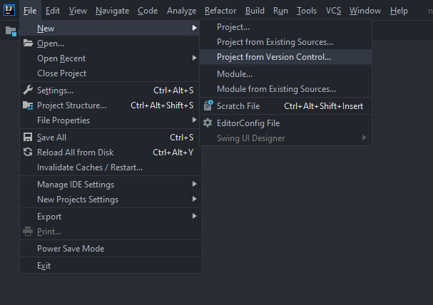

# What you need

1. [Java Development Kit](https://www.oracle.com/java/technologies/javase/)
1. [IntelliJ idea](https://www.jetbrains.com/idea/download/)

## Alternatively if you don't want to use IntelliJ Idea

1. [Eclipse](https://www.eclipse.org/downloads/)
1. [Sourcetree](https://www.sourcetreeapp.com/)

# P01 - Hallo Welt

## Get the exercise

To start the exercise go to the [Artemis page](https://artemis.ase.in.tum.de/#/courses/83/exercises/2135) and click the _Start exercise_ button in the upper left corner.

After a few seconds the button should change to Clone Repository.
When you click that button, a popup with a link like this should open up:

```
https://ge75pec@bitbucket.ase.in.tum.de/scm/PGDP2021W01P01/pgdp2021w01p01-ge75pec.git
        ^Your TUM-ID                        ^The exercise you are doing
```

Now open your IntelliJ and go to `File -> New -> Project from from Version Control...`



Paste the link from Artemis into the URL field and click clone :)

## Files and folders in our exercise

> At this point I need to restart my IntelliJ because the view is really strange.

Press Alt-1 to open a project view with all the files and folders in your exercise.
If that does not work use the context menu at the top: `View -> Tool Windows -> Project`

We only need to focus on the files in `src/pgdp/intro`.
You should see a file called HelloWorld that you need to open.

## Main methods

```Java
//file: src/pgdp/intro/HelloWorld.java
package pgdp.intro;

import static pgdp.MiniJava.*;

public class HelloWorld {
  // highlight-next-line
  public static void main(String[] args) {
  }
}
```

I want you to ignore all except the highlighted line.
What you see is a _main method_,
which contains the code,
that is actually run when you start your program.

For this exercise you need to use a method.

Think of methods as a box,
which contains magic midgets.

**TODO Missing image**

There might be holes in that box so that you can _pass_ something inside.
When you give the midgets something to work with,
thats called an argument.

Lets have a look at one of those magic midget boxes:

```Java
	public static void write(String output) {
		System.out.println(output);
	}
```

Every method has a method signature,
that describes the form of the box,
how many holes are there etc.

```Java
	public static void write(String output) {
//                ^Return type (void == no return)
//                     ^Name
//                           ^Argument types and names
		...
	}
```

Inside the curly brackets is where you tell your midgets what they have to do.

```Java
	public static void write(String output) {
    //highlight-next-line
		System.out.println(output);
	}
```

## What do midgets have to do with our task?

Good question!

Our task is to print out the String "Hallo Welt!",
so what does that mean?

We somehow need to let our main method print out something.
Looks like a job for the `write()` method doesn't it?
Let's put it in our main method:

```Java
//file: src/pgdp/intro/HelloWorld.java
package pgdp.intro;

import static pgdp.MiniJava.*;

public class HelloWorld {
  public static void main(String[] args) {
  // highlight-next-line
    write();
  }
}
// Note that the line is finished with a semicolon;
```

You still need to tell the method what it has to write so we need to add that:

```Java
//file: src/pgdp/intro/HelloWorld.java
package pgdp.intro;

import static pgdp.MiniJava.*;

public class HelloWorld {
  public static void main(String[] args) {
  // highlight-next-line
    write("Hallo Welt!");
  }
}
// Note that the line is finished with a semicolon;
```

When you run it with the green arrow to left you should see this:
`Hallo Welt!`

### Abgabe

# P02 - Summieren

Wie bei der Aufgabe oben die dateien holen und öffnen.

```Java
package pgdp.intro;

import static pgdp.MiniJava.*;

public class Sum {

    public static void main(String[] args) {
        int sum = 0;
      //        ^ assignment operator. The variable sum of type int is now 0
        int input = 1;

        while (input != 0) {
      //^^^^^ while-loop: checks the condition inside
      //      and repeats the statements within the {}
      //      if the expression inside () evaluates to true.
      //      -> keeps asking for input until input is 0
            input = readInt("Bitte Zahl eingeben:");
      //            ^^^^^^^ Method call of readInt, which returns a String
      //                    that is saved in the variable input
            sum += input;
      //        ^^ Same as `sum = sum + input` but shorter
      //           the + is just addition for integers
        }
        write("Summe:");
        write(sum);
      //      ^^^ Print out your sum after the user inputs a 0
    }

}

```
